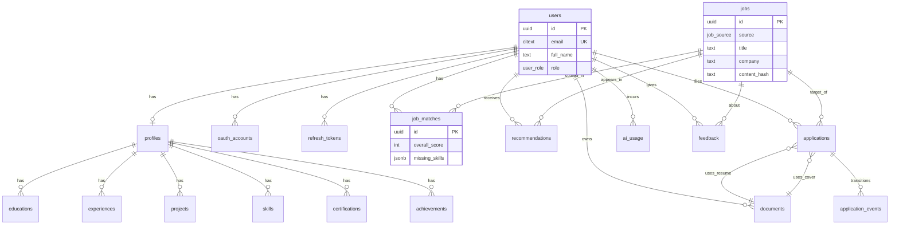

# ER Diagram

```mermaid
erDiagram
    users ||--o| profiles : has
    users ||--o{ oauth_accounts : has
    users ||--o{ refresh_tokens : has
    users ||--o{ documents : owns
    users ||--o{ job_matches : has
    users ||--o{ recommendations : receives
    users ||--o{ applications : files
    users ||--o{ ai_usage : incurs
    users ||--o{ feedback : gives

    profiles ||--o{ educations : has
    profiles ||--o{ experiences : has
    profiles ||--o{ projects : has
    profiles ||--o{ skills : has
    profiles ||--o{ certifications : has
    profiles ||--o{ achievements : has

    jobs ||--o{ job_matches : scored_in
    jobs ||--o{ recommendations : appears_in
    jobs ||--o{ applications : target_of
    jobs ||--o{ feedback : about

    applications ||--o{ application_events : transitions
    applications }o--|| documents : uses_resume
    applications }o--|| documents : uses_cover

    users {
      uuid id PK
      citext email UK
      text full_name
      user_role role
    }
    jobs {
      uuid id PK
      job_source source
      text title
      text company
      text content_hash
    }
    job_matches {
      uuid id PK
      int overall_score
      jsonb missing_skills
    }
```
